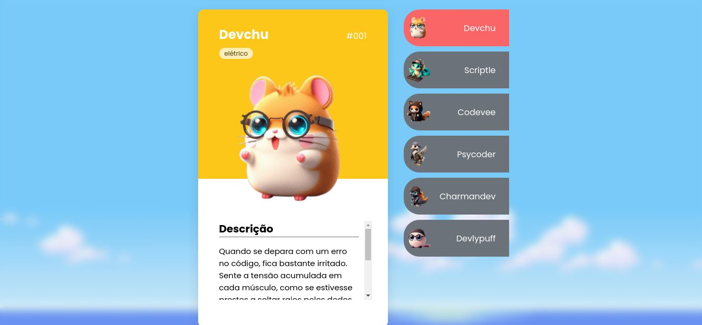

# MGRobot

MGRobot é uma página desenvolvida em HTML, CSS e JS para demonstração do que aprendi na aula @devemdobro

O Design desenvolvido em aula é um pouco diferente desse que estou compartilhando, fiz algumas modificações, inclusive das imagens, efeitos, bordas, plano de fundo, texto, nome dos personagens, entre outras alterações.

Desenvolvi um JS próprio pois ainda não chegamos na aula de JavaScript, mas quis criar um próprio para já deixar o código pronto.

## Design Anterior (Aula)

## Design Alterado para

# License

The MGRobot is provided under:

[SPDX-License-Identifier: MIT](https://spdx.org/licenses/MIT.html)

Licensed under the MIT license.